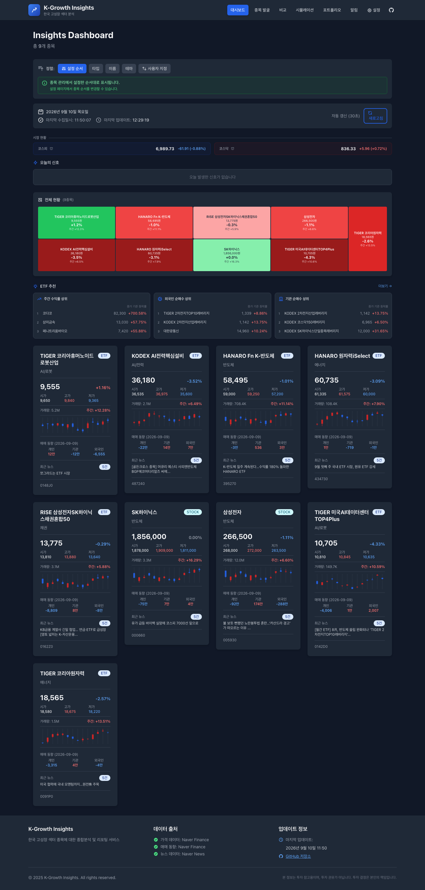
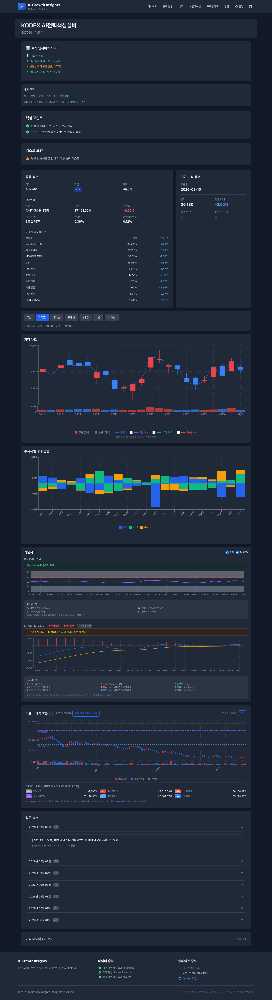
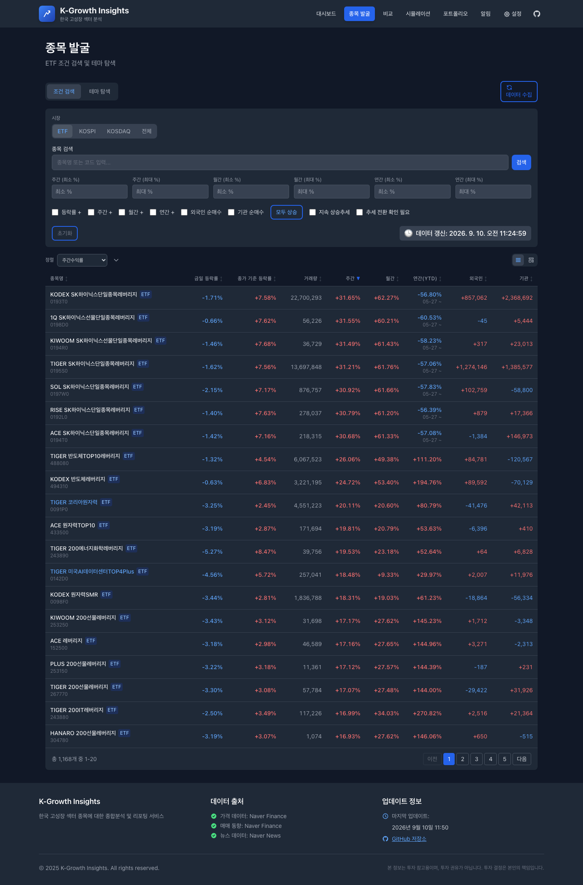
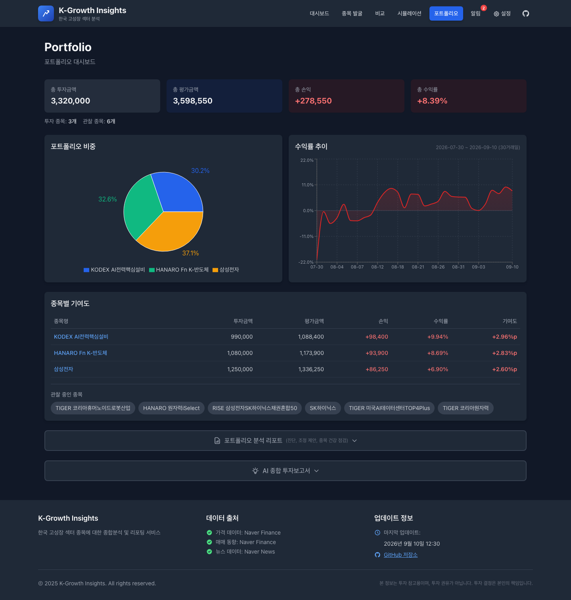
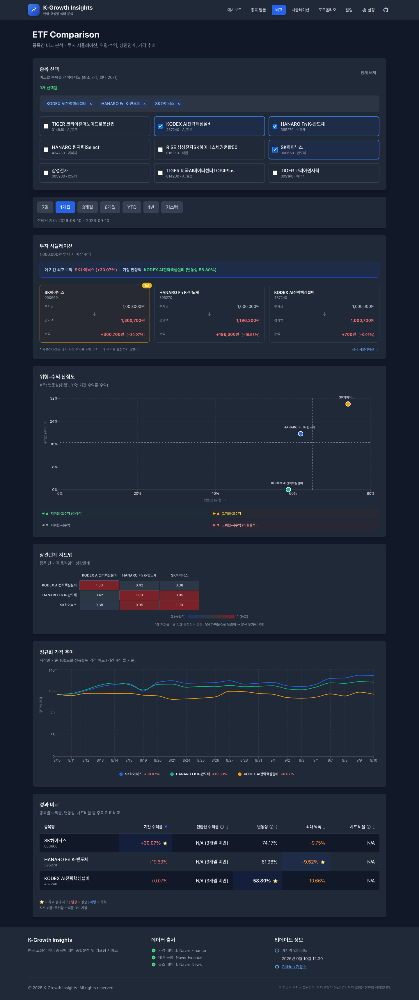
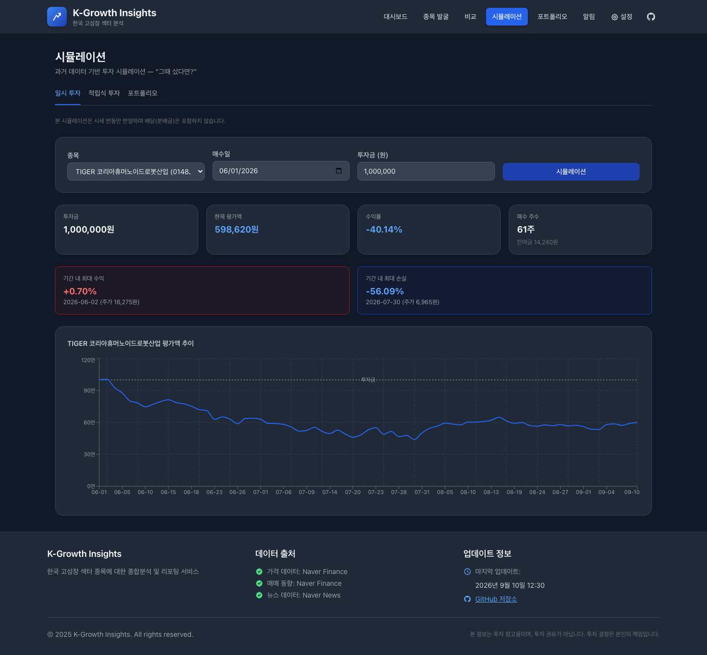
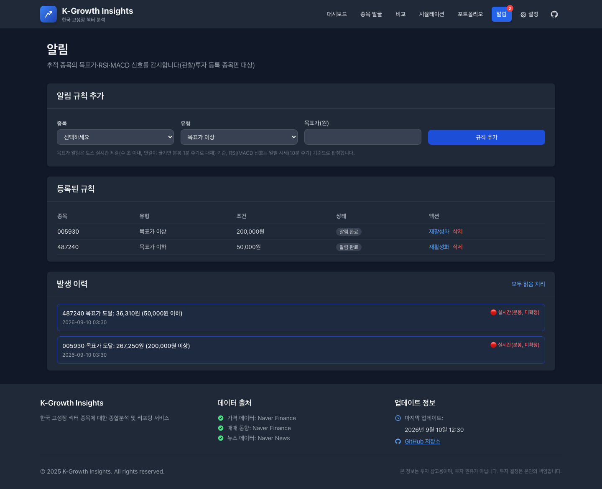
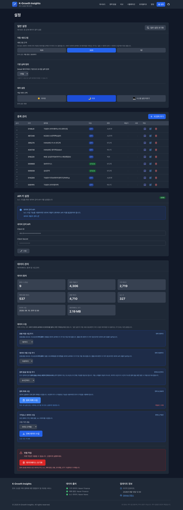

# K-Growth Insights

한국 ETF·주식을 위한 개인용 투자 분석 대시보드입니다. **토스증권 Open API 실시간 시세**와
네이버 금융 데이터를 함께 사용해, 관심 종목의 시세·수급·기술적 신호를 한 화면에서 확인하고
목표가·신호 알림, 포트폴리오 평가, 과거 데이터 기반 시뮬레이션까지 지원합니다.

macOS 데스크톱 앱(dmg)으로도 배포할 수 있어 브라우저 없이 독립 실행형 앱으로도 쓸 수 있습니다.


> ⚠️ 본 서비스가 제공하는 정보는 투자 참고용이며 투자 권유가 아닙니다. 투자 결정과 그 책임은
> 전적으로 사용자 본인에게 있습니다.

## 목차

- [주요 기능](#주요-기능)
  - [대시보드](#1-대시보드)
  - [종목 상세](#2-종목-상세)
  - [종목 발굴(스캐너)](#3-종목-발굴스캐너)
  - [포트폴리오](#4-포트폴리오)
  - [ETF 비교](#5-etf-비교)
  - [투자 시뮬레이션](#6-투자-시뮬레이션)
  - [알림](#7-알림)
  - [설정](#8-설정)
- [기술 스택](#기술-스택)
- [시작하기](#시작하기)
  - [필수 요구사항](#필수-요구사항)
  - [환경변수 설정](#환경변수-설정)
  - [개발 모드로 실행](#개발-모드로-실행)
  - [macOS 데스크톱 앱(dmg) 빌드](#macos-데스크톱-앱dmg-빌드)
- [데이터 출처](#데이터-출처)
- [프로젝트 구조](#프로젝트-구조)

## 주요 기능

### 1. 대시보드

등록한 전체 종목을 한 화면에서 모아 봅니다. 코스피·코스닥 지수와 종목별 현재가·등락률이
**토스증권 실시간 시세로 3초 주기 자동 갱신**되며, 캔들 미니차트·거래대금·투자자별(개인/기관/외국인)
매매동향·최근 뉴스까지 카드 하나에 요약해 보여줍니다. 상단의 "ETF 추천" 카드는 주간 수익률·
외국인 순매수·기관 순매수 상위 종목을 프리셋별로 추려 보여줍니다.



### 2. 종목 상세

개별 종목의 AI 투자 인사이트 요약, 캔들 차트(이동평균 포함), 투자자별 매매동향, RSI·MACD
기술지표, 그리고 "오늘의 가격 흐름"(당일 분봉, 진행 중인 마지막 분봉까지 실시간 갱신)을
한 페이지에서 확인합니다. ETF는 NAV·괴리율·총보수와 주요 구성종목까지 함께 표시됩니다.



### 3. 종목 발굴(스캐너)

ETF/코스피/코스닥 전체 종목을 대상으로 주간·월간·연간 등락률, 외국인·기관 순매수 여부, 추세
전환 등 다양한 조건으로 필터링하고 정렬합니다. "테마 탐색" 탭에서는 테마별로 종목을 묶어
탐색할 수 있습니다.



### 4. 포트폴리오

Settings에 등록한 매입가·보유수량을 기준으로 총 투자금액·평가금액·손익·수익률을 계산합니다.
평가금액은 **토스증권 실시간 시세를 우선 반영**해 배치(종가) 데이터보다 더 빠르게 갱신되며,
종목별 비중(파이차트), 기간 수익률 추이, 종목별 기여도 테이블, 그리고 AI 기반 포트폴리오
분석·종합 투자보고서까지 제공합니다.



### 5. ETF 비교

최대 20개 종목을 선택해 동일 금액을 투자했다면 얼마가 됐을지 시뮬레이션하고, 위험-수익 산점도·
상관관계 히트맵·정규화 가격 추이·변동성/최대낙폭/샤프비율 등 성과 지표를 한 번에 비교합니다.



### 6. 투자 시뮬레이션

"그때 샀다면?" 컨셉의 과거 데이터 기반 시뮬레이션입니다. 일시 투자, 적립식 투자, 포트폴리오
단위 투자 세 가지 방식을 지원하며 매수일과 투자금을 입력하면 현재까지의 평가액 추이·최대
수익/손실 구간을 계산해 보여줍니다.



### 7. 알림

목표가 도달, RSI 과매수/과매도 진입, MACD 골든/데드크로스를 감시하는 규칙을 등록합니다.
목표가 알림은 **토스증권 실시간 체결가 기준으로 수 초 이내에 트리거**되며(연결이 끊기면 분봉
1분 주기 판정으로 자동 대체), 발생 이력에서 실시간(미확정)/확정 종가 기준을 구분해 보여줍니다.



### 8. 설정

자동 새로고침 주기·기본 날짜 범위·라이트/다크 테마 등 화면 동작을 설정하고, 추적할 종목을
추가·삭제·순서 변경합니다. 뉴스 수집용 네이버 검색 API 키 등록, 데이터베이스 통계 확인, 가격·
수급·뉴스 데이터 수동 수집도 이 화면에서 처리합니다.



## 기술 스택

| 영역 | 구성 |
| --- | --- |
| 백엔드 | Python 3.11+, FastAPI, SQLite, APScheduler(주기적 데이터 수집) |
| 프론트엔드 | React 18, Vite 5, TanStack Query, Recharts, Tailwind CSS |
| 실시간 시세 | 토스증권 Open API (OAuth2, WebSocket 체결가 스트림) |
| 보조 데이터 | 네이버 금융/검색 API (펀더멘털·수급·뉴스·시장 지수) |
| 데스크톱 패키징 | Electron + electron-builder (macOS dmg) |

## 시작하기

### 필수 요구사항

- Python 3.11 이상, [uv](https://docs.astral.sh/uv/)
- Node.js 18 이상, npm
- 토스증권 Open API 자격증명([발급 안내](https://openapi.tossinvest.com))
- (선택) 네이버 검색 API 자격증명 — 없으면 뉴스 수집만 비활성화되고 나머지 기능은 정상 동작

### 환경변수 설정

저장소 루트에 `.env` 파일을 만들고 `.env.example`을 참고해 값을 채웁니다.

```bash
cp .env.example .env
# .env를 열어 TOSS_CLIENT_ID / TOSS_CLIENT_SECRET (필수),
# NAVER_CLIENT_ID / NAVER_CLIENT_SECRET (선택)을 입력합니다.
```

### 개발 모드로 실행

```bash
# 백엔드 의존성 설치
cd backend && uv sync --extra dev && cd ..

# 프론트엔드 의존성 설치
cd frontend && npm install && cd ..

# 백엔드(:8000)+프론트엔드(:5173) 동시 실행
./run.sh

# 종료
./stop.sh
```

실행 후 브라우저에서 `http://localhost:5173`으로 접속합니다.

### macOS 데스크톱 앱(dmg) 빌드

```bash
./build-dmg.sh --arch arm64      # Apple Silicon
./build-dmg.sh --arch x64        # Intel
./build-dmg.sh --arch both       # 둘 다
```

빌드가 끝나면 `desktop/release/`에 설치용 `.dmg` 파일이 생성됩니다. 데스크톱 앱은 최초 실행
시 독립된 Python 가상환경을 자동으로 구성하므로 별도의 `uv`/`npm` 설치 없이 배포할 수 있습니다.

## 데이터 출처

| 데이터 | 출처 | 갱신 방식 |
| --- | --- | --- |
| 실시간 체결가·호가 | 토스증권 Open API (WebSocket) | 실시간(수 초 이내) |
| 캔들·투자자별 매매동향 | 토스증권 Open API (REST) | 주기적 수집 |
| 펀더멘털(PER/PBR/EPS/BPS/배당/52주) | 네이버 금융 | 주기적 수집 |
| ETF NAV·괴리율·총보수·구성종목 | 네이버 금융 | 주기적 수집 |
| 뉴스 | 네이버 검색 API | 주기적 수집 |
| 시장 지수(코스피/코스닥) | 토스증권 Open API(실시간) + 네이버(보조) | 실시간 3초 갱신 |

## 프로젝트 구조

```
backend/            FastAPI 백엔드 (routers/services/SQLite)
frontend/            React + Vite 프론트엔드
desktop/             Electron 데스크톱 앱 셸(macOS dmg 패키징)
build-dmg.sh         데스크톱 앱 빌드 스크립트
run.sh / stop.sh     개발 서버 기동/종료 스크립트
docs/screenshots/    이 README에 쓰인 스크린샷
```
