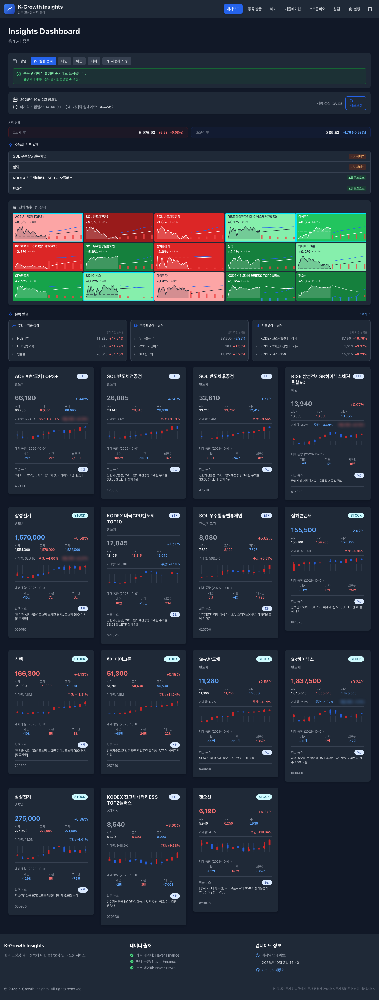
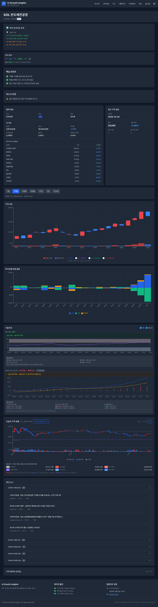
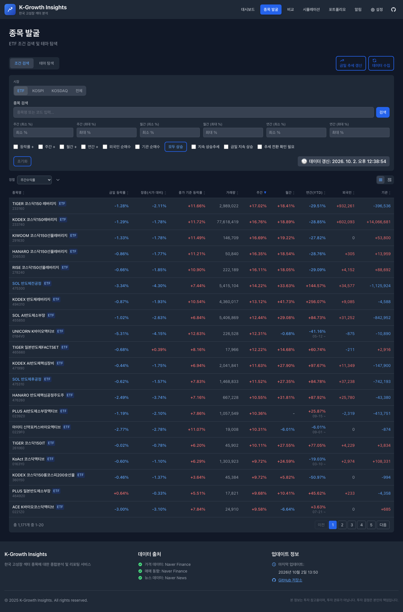
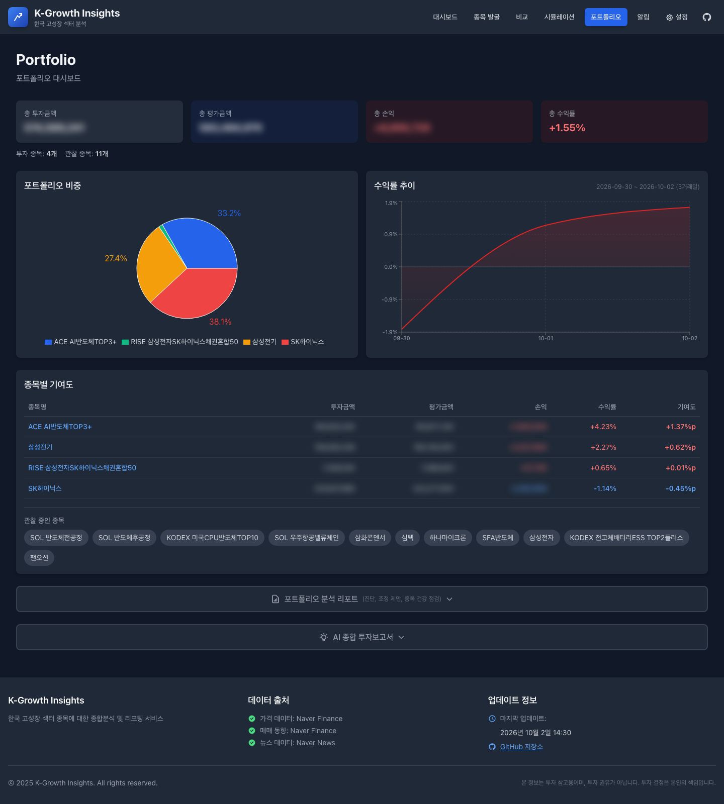
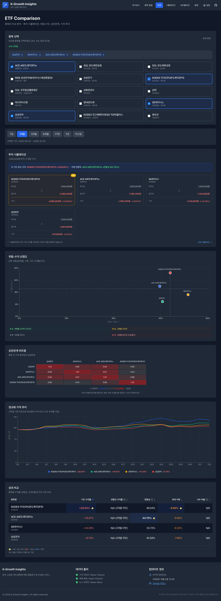
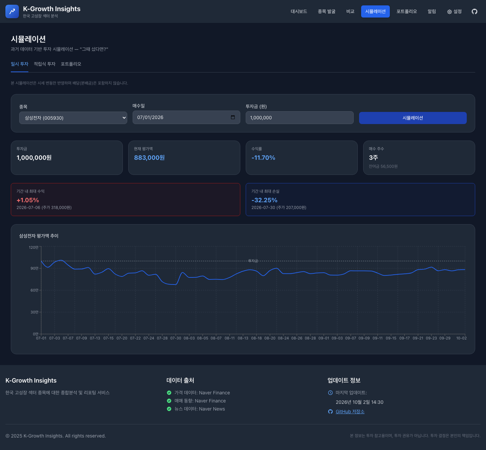
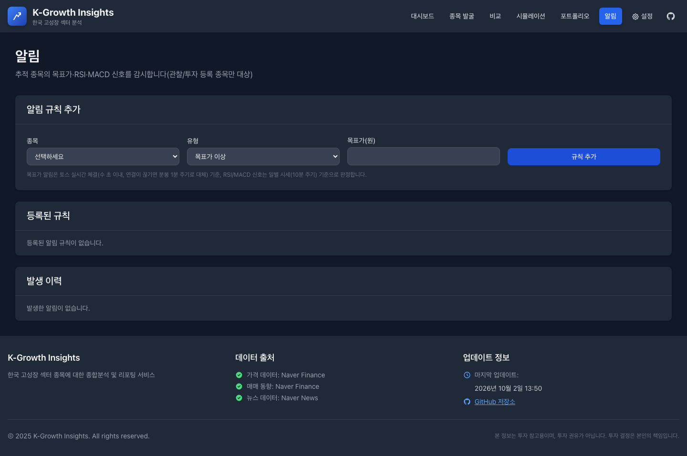
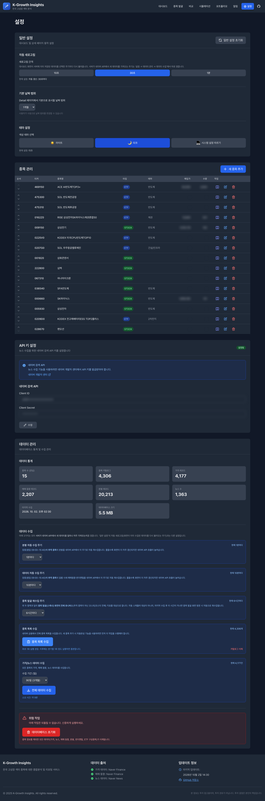

# K-Growth Insights TOSS

한국 ETF·주식을 위한 개인용 투자 분석 대시보드입니다. **토스증권 Open API 실시간 시세**와
네이버 금융 데이터를 함께 사용해, 관심 종목의 시세·수급·기술적 신호를 한 화면에서 확인하고
목표가·신호 알림, 포트폴리오 평가, 과거 데이터 기반 시뮬레이션까지 지원합니다.

macOS 데스크톱 앱(dmg)으로도 배포할 수 있어 브라우저 없이 독립 실행형 앱으로도 쓸 수 있습니다.


> ⚠️ 본 서비스가 제공하는 정보는 투자 참고용이며 투자 권유가 아닙니다. 투자 결정과 그 책임은
> 전적으로 사용자 본인에게 있습니다.

## 목차

- [주요 기능](#주요-기능)
  - [대시보드](#1-대시보드)
  - [종목 상세](#2-종목-상세)
  - [종목 발굴(스캐너)](#3-종목-발굴스캐너)
  - [포트폴리오](#4-포트폴리오)
  - [ETF 비교](#5-etf-비교)
  - [투자 시뮬레이션](#6-투자-시뮬레이션)
  - [알림](#7-알림)
  - [설정](#8-설정)
- [기술 스택](#기술-스택)
- [시작하기](#시작하기)
  - [필수 요구사항](#필수-요구사항)
  - [환경변수 설정](#환경변수-설정)
  - [개발 모드로 실행](#개발-모드로-실행)
  - [macOS 데스크톱 앱(dmg) 빌드](#macos-데스크톱-앱dmg-빌드)
- [데이터 출처](#데이터-출처)
- [데이터 수집 방식](#데이터-수집-방식)
- [프로젝트 구조](#프로젝트-구조)

## 주요 기능

### 1. 대시보드

등록한 전체 종목을 한 화면에서 모아 봅니다. 코스피·코스닥 지수와 종목별 현재가·등락률이
**토스증권 실시간 시세로 자동 갱신**(종목 1초, 지수 3초 주기)되며, 현재가가 바뀔 때 캔들 미니차트·
주간 수익률·매입 대비 수익률도 함께 갱신됩니다.

- **시장 현황**: 코스피·코스닥 현재가와 등락. 지수를 누르면 기간별 지수 차트(당일 분봉 포함) 팝업이 열립니다.
- **오늘의 신호**: 추적 종목 중 오늘 MACD 골든/데드크로스가 나왔거나 RSI 과매수·과매도 구간에 새로
  들어간 종목만 모아 보여줍니다.
- **전체 현황 히트맵**: 종목별 등락률을 색으로 보여주고, 셀마다 당일 분봉 미니그래프(전일 종가 점선
  포함)와 주간 MACD 미니차트를 그립니다. 보유 종목은 테두리로 강조되고, 셀을 누르면 상세로 이동합니다.
- **종목 발굴 카드**: 주간 수익률·외국인 순매수·기관 순매수 상위 종목을 추려 보여줍니다. 등록하지 않은
  종목을 누르면 종목 추가 화면으로 바로 이어집니다.
- **종목 카드**: 현재가·시가/고가/저가·거래량·주간 수익률·매입 대비 수익률, 일봉 미니 캔들, 최근
  거래일 투자자별(개인/기관/외국인) 매매동향, 최근 뉴스를 카드 하나에 요약합니다.
- **정렬·관리**: 설정 순서/타입/이름/테마/사용자 지정 순으로 정렬합니다. 카드나 히트맵 셀을 드래그하면
  순서가 저장되고 '사용자 지정' 정렬로 바뀝니다. 우클릭하면 종목을 삭제할 수 있습니다.



### 2. 종목 상세

개별 종목의 분석을 한 페이지에 모았습니다.

- **투자 인사이트 요약·투자 전략**: 추세·변동성·수급으로 뽑은 기술적 신호와 리스크, 단기/중기/장기
  전략 의견, 핵심 포인트·리스크 요인(규칙 기반 분석)
- **종목 정보·펀더멘털**: PER·PBR·EPS·배당수익률·외국인 지분율·시가총액·52주 최고/최저.
  ETF는 운용사·NAV·괴리율·순자산총액·총보수·분배금수익률과 주요 구성종목(비중·실시간 등락률)까지 표시합니다.
- **최근 가격 정보**: 실시간 현재가·전일 대비, 보유 종목이면 매입가·보유 수량·평가 금액·매입 대비 손익
- **차트**: 기간(7일~1년·YTD·직접 지정) 선택, 가격 차트(이동평균 5/10/20일), 투자자별 매매 동향,
  RSI·MACD 기술지표(읽는 법 안내 포함). 오늘 봉과 지표도 실시간 시세에 맞춰 함께 움직이며, 가격
  차트를 클릭해 기준일을 지정할 수 있습니다.
- **오늘의 가격 흐름**: 당일 분봉 캔들과 전일 종가 기준선, 피봇 지지·저항선(PP·R1·R2·S1·S2).
  진행 중인 마지막 분봉까지 실시간 갱신됩니다.
- **최근 뉴스·가격 데이터 표**



### 3. 종목 발굴(스캐너)

ETF/코스피/코스닥 종목을 조건으로 걸러 내고 정렬합니다. 수익률·수급 지표는 전체 ETF와 코스피
시가총액 상위 200개, 코스닥 상위 300개 종목에 대해 수집하며, 그 밖의 종목은 지표가 비어 있을 수 있습니다.

- **조건 검색**: 시장(ETF/KOSPI/KOSDAQ/전체), 종목명·코드 검색, 주간·월간·연간 등락률 범위,
  등락률·주간·월간·연간 플러스, 외국인·기관 순매수, 추세 전환 확인 필요 등의 조건을 조합합니다.
  "모두 상승"은 등락률·주간·월간·연간 플러스를 한 번에 켜고, "지속 상승추세"는 연초 이후 꾸준히 오른
  종목(추세 직선성·최대 낙폭·월별 승률·20일선 유지 기준)만 남깁니다.
- **금일 지속 상승**: 오늘 정규장 분봉을 기준으로 시가 대비 상승, 추세선 적합도(R²) 60% 이상, 장중
  고점 대비 하락폭 -2% 이내, 시가 위에 머문 시간 70% 이상인 종목만 골라 냅니다. 급등 후 밀리는 종목이나
  V자 반등 종목은 걸러지며, 결과 표의 "장중(시가 대비)" 열로 정렬할 수 있습니다.
- **결과 보기**: 테이블(금일/장중/종가 기준 등락률·거래량·주간·월간·연간·외국인·기관, 열 정렬)과
  히트맵(주간 수익률 색, 거래량 크기) 중에서 고릅니다. 등록하지 않은 종목은 결과에서 바로 추가할 수 있습니다.
- **테마 탐색**: 테마별로 종목을 묶어 평균 주간 수익률과 함께 봅니다.
- **데이터 수집 / 금일 추세 갱신**: "데이터 수집"은 시세·수급·지표 전체를 다시 받고(수 분 이상 소요),
  "금일 추세 갱신"은 장중 분봉만 빠르게 다시 받아 금일 지속 상승 판정을 최신으로 맞춥니다.



### 4. 포트폴리오

설정의 거래내역으로 계산된 평단가·보유수량을 기준으로 총 투자금액·평가금액·손익·수익률을 계산합니다.
평가금액은 **토스증권 실시간 시세를 우선 반영**해 배치(종가) 데이터보다 더 빠르게 갱신됩니다.

- 종목별 비중(파이차트), 매수 이후 수익률 추이(최근 30거래일), 종목별 기여도 테이블, 관찰 중인 종목 목록
- **포트폴리오 분석 리포트**: 포트폴리오 진단, 조정 제안, 보유 종목 건강 점검, 관찰 종목 동향
- **AI 종합 투자보고서**(AI 투자분석 프롬프트): 선택한 종목(Shift+클릭으로 복수 선택하면 통합 비교)의
  데이터를 담은 분석 프롬프트를 만들어 줍니다. 복사하거나 `.md`로 내려받아 Perplexity·Gemini·
  ChatGPT·Claude 등에 붙여넣어 쓰면 되고, 각 서비스로 가는 바로가기도 있습니다.


<sub>스크린샷의 금액은 가려 두었습니다(대시보드의 매입 대비 수익률도 동일).</sub>

### 5. ETF 비교

2~20개 종목을 고르고 기간을 정하면 다음을 한 번에 비교합니다.

- **투자 시뮬레이션**: 종목마다 같은 금액(100만 원)을 넣었을 때의 평가액과 수익, 기간 최고 수익·가장 안정적인 종목
- **위험-수익 산점도**(변동성 대비 수익률), **상관관계 히트맵**, **정규화 가격 추이**(시작일 100 기준)
- **성과 비교 표**: 기간 수익률·연환산 수익률·변동성·최대 낙폭·샤프 비율



### 6. 투자 시뮬레이션

"그때 샀다면?" 컨셉의 과거 데이터 기반 시뮬레이션입니다(분배금·배당 미포함).

- **일시 투자**: 매수일·투자금을 넣으면 현재 평가액·수익률·매수 주수와 기간 내 최대 수익/손실, 평가액 추이
- **적립식 투자**: 기간·매월 매수일·월 투자금으로 평균 매수가·누적 주수와 월별 매수 내역
- **포트폴리오**: 여러 종목과 비중을 정해 종목별 결과와 전체 성과



### 7. 알림

목표가 이상/이하, RSI 과매수/과매도 진입, MACD 골든/데드크로스를 감시하는 규칙을 등록합니다
(관찰·투자로 등록한 종목 대상). 목표가 알림은 **토스증권 실시간 체결가 기준으로 수 초 이내에
트리거**되며(연결이 끊기면 분봉 1분 주기 판정으로 대체), RSI·MACD는 일별 시세 수집 때 판정합니다.
발생 이력에서 실시간(미확정)/확정 종가 기준을 구분해 보여주고, 읽지 않은 알림 수는 상단 메뉴에 표시됩니다.
발동된 규칙은 다시 활성화하거나 삭제할 수 있습니다.



### 8. 설정

- **일반 설정**: 화면 자동 새로고침 간격, 상세 페이지 기본 날짜 범위, 라이트/다크/시스템 테마
- **종목 관리**: 추적 종목 추가(종목명·코드 검색, 네이버 자동 입력, 뉴스 검색 키워드)·수정·삭제·순서 변경.
  매입가·보유수량은 종목별 거래내역(매수/매도)을 등록하면 평단가로 자동 계산되고 실현손익도 함께 보입니다.
- **API 키 설정**: 뉴스 수집용 네이버 검색 API 키 등록
- **데이터 관리**: 데이터 통계(종목·가격·매매동향·분봉·뉴스 수, DB 크기), 분봉·일별 데이터 자동 수집
  주기, 종목 발굴 재수집 주기, 종목 목록 수집, 기간을 정한 가격·뉴스 전체 수집, 데이터베이스 초기화


<sub>스크린샷의 매입가·수량과 API 키는 가려 두었습니다.</sub>

## 기술 스택

| 영역 | 구성 |
| --- | --- |
| 백엔드 | Python 3.11+, FastAPI, SQLite, APScheduler(주기적 데이터 수집) |
| 프론트엔드 | React 18, Vite 5, TanStack Query, Recharts, Tailwind CSS |
| 실시간 시세 | 토스증권 Open API (OAuth2, WebSocket 체결가 스트림) |
| 기타 데이터 | 네이버 금융/검색 API (일별 시세·분봉·수급·펀더멘털·ETF·뉴스·지수 차트·종목 카탈로그) |
| 데스크톱 패키징 | Electron + electron-builder (macOS dmg) |

## 시작하기

### 필수 요구사항

- Python 3.11 이상, [uv](https://docs.astral.sh/uv/)
- Node.js 18 이상, npm
- 토스증권 Open API 자격증명([발급 안내](https://openapi.tossinvest.com))
- (선택) 네이버 검색 API 자격증명 — 없으면 뉴스 수집만 비활성화되고 나머지 기능은 정상 동작

### 환경변수 설정

저장소 루트에 `.env` 파일을 만들고 `.env.example`을 참고해 값을 채웁니다.

```bash
cp .env.example .env
# .env를 열어 TOSS_CLIENT_ID / TOSS_CLIENT_SECRET (필수),
# NAVER_CLIENT_ID / NAVER_CLIENT_SECRET (선택)을 입력합니다.
```

### 개발 모드로 실행

```bash
# 백엔드 의존성 설치
cd backend && uv sync --extra dev && cd ..

# 프론트엔드 의존성 설치
cd frontend && npm install && cd ..

# 백엔드(:8000)+프론트엔드(:5173) 동시 실행
./run.sh

# 종료
./stop.sh
```

실행 후 브라우저에서 `http://localhost:5173`으로 접속합니다.

### macOS 데스크톱 앱(dmg) 빌드

```bash
./build-dmg.sh --arch arm64      # Apple Silicon
./build-dmg.sh --arch x64        # Intel
./build-dmg.sh --arch both       # 둘 다
```

빌드가 끝나면 `desktop/release/`에 설치용 `.dmg` 파일이 생성됩니다. 데스크톱 앱은 최초 실행
시 독립된 Python 가상환경을 자동으로 구성하므로 별도의 `uv`/`npm` 설치 없이 배포할 수 있습니다.

## 데이터 출처

| 데이터 | 출처 | 갱신 방식 |
| --- | --- | --- |
| 실시간 체결가 | 토스증권 Open API (WebSocket) | 체결 즉시 수신, 화면은 1초마다 반영 |
| 당일 시가·고가·저가 보정 | 토스증권 Open API (REST 일봉) | 실시간 시세 정합 시 |
| 시장 지수(코스피/코스닥) 실시간가 | 토스증권 Open API (REST) | 3초 폴링 |
| 일별 시세·분봉·투자자별 매매동향 | 네이버 금융 | 주기적 수집 |
| 종목 카탈로그(종목 발굴 대상) | 네이버 금융 | 종목 발굴 "데이터 수집" 또는 설정의 종목 목록 수집 시 |
| 펀더멘털(PER/PBR/EPS/BPS/배당/52주) | 네이버 금융 | 주기적 수집 |
| ETF NAV·괴리율·총보수·구성종목 | 네이버 금융 | 주기적 수집 |
| 시장 지수 일별 차트·분봉 | 네이버 금융 | 화면 조회 시 |
| 뉴스 | 네이버 검색 API | 주기적 수집 |

토스 Open API는 계정당 초당 1회로 요청이 제한돼, 대량 순회가 필요한 데이터는 네이버에서 받습니다.

## 데이터 수집 방식

이 앱은 상시 서버가 아니라 켜 둔 동안만 동작합니다. 그래서 다음 두 가지로 데이터를 채웁니다.

- **켜져 있는 동안**: 평일 장중에는 일별 시세·수급·펀더멘털·뉴스를 10분마다, 분봉을 1분마다(기본값)
  받고, 15:40에 마감 시세를 확정 수집합니다. 주기는 설정 화면에서 바꿀 수 있습니다.
- **앱을 켤 때**: 꺼져 있던 동안 놓친 거래일이 있으면 백그라운드에서 그만큼 보충 수집하고, 분봉도
  새로 받은 뒤 실시간 시세의 전일 종가 기준을 다시 계산합니다. 화면은 기다리지 않고 바로 쓸 수
  있습니다.

## 프로젝트 구조

```
backend/            FastAPI 백엔드 (routers/services/SQLite)
frontend/            React + Vite 프론트엔드
desktop/             Electron 데스크톱 앱 셸(macOS dmg 패키징)
build-dmg.sh         데스크톱 앱 빌드 스크립트
run.sh / stop.sh     개발 서버 기동/종료 스크립트
sync-desktop-db.sh   설치된 데스크톱 앱 DB를 개발 환경 DB로 복사
docs/screenshots/    이 README에 쓰인 스크린샷
```
